# 线索整理

## 生日会回放

以下载后分时段提取的所有帧为准，重新整理一下线索。

### 5:00-6:30

#### 221 帧


有二维码，手绘重建后扫描结果为 `themoon`。


但是除了微信好像别的扫不太出来不知道为什么。

右下角的密文

```
bmfy'x wjfq
bmfy'x kfpj
```

凯撒密码，解密得到 `what's real what's fake`

#### 334 帧


有密文，处理一下。


提取后得到 `4oCc5bey57uP5b6I5pma5LqG77yMYWlyaXPjgILigJ0K4oCc5ZOl5ZOl77yM5ZOl5ZOl77yM5YaN57uZYWlyaXPorrLkuKrmlYXkuovlkKfjgILigJ0K4oCc5aW95ZCn5aW95ZCn77yM5pyA5ZCO5LiA5Liq5ZOm44CC6L+Z5Liq5pWF5LqL55qE5Li76KeS5Lmf5Y+rYWlyaXPvvIzot5/kvaDkuIDmoLflkaLigKbigKbigJ0=`

base64 解码结果：

```
“已经很晚了，airis。”
“哥哥，哥哥，再给airis讲个故事吧。”
“好吧好吧，最后一个哦。这个故事的主角也叫airis，跟你一样呢……”
```

#### 349 帧


后面的数字通过之后的画面可以看出是 5、7、9，暂不清楚含义。

#### 428 帧


背景文字为 `ZVTLAPTLZ H ZVUN APASL PZ TVYL PTWVYAHUA AOHU PAZ SFYPJZ`，凯撒密码破解得到 `SOMETIMES A SONG TITLE IS MORE IMPORTANT THAN ITS LYRICS`。可能是提示我们注意作品名 `themoon`。

#### 444 帧


`jTX+iZRM08hYS6Lb7v3JcwyYL2cobfHVrITtyjamDuvqL7Scd35Nf4H8T1rdYTBMhRZgQmST1PF/zmTyE0eNNzcVnG95h5/sBgN8XRY4ihPP4chhoFKqkGum0460qwKyoAV8dEiE9PBrcjeLMaCQD6G7RxuzWr2dLXtCOGvyNi09J4ZINbfckJDmc0OC7kMWmgsW2xdl7eGq/5ozd/lteBIG/748+pGEMvYlMHtULHrIfnthz3AJB/1Oi8hPXFxdz8OBe0aQP4suMRBGtAYyzIQs3Hk4j2ob5BJxZDBYNVTa+9Ucky+sxNY0LtAR7HxUTY5rwb+1crYq65OGC9NoN9Zir1UEsZh1WRr/i5yGVBE=`

暂不清楚解密方法。

#### 447 帧


提取文本 `RO HXD MXW'C DWMNABCJWM BXVN XO CQN ADUN, RC VNJWB HXD FXW'C WNNM RC OXA WXF.`，也是凯撒密码，解密得到 `IF YOU DON'T UNDERSTAND SOME OF THE RULE, IT MEANS YOU WON'T NEED IT FOR NOW.`

#### 613-626 帧

闪过了许多密文，推测是同一文本的内容，所以放在一起了。


一起处理一下。


分别提取文本。

- `mANGeI6gaNboS0nCDPvNd4FvxLWeTGiZq2mbbWpMbh hW57Y+iOcyrB1ey7WHgM3Hm28ivlKpcQP0XptpjIA`
- `dwH5fqh5kLeDzgpQTCTyiTO1L9L1kx56hDCuVFHyB bIY5flaUQbJXtBgzoA8SSXhbkiZYXjCCB8rjMo2Il`
- `sYblwpfBbPzVrW1VN4hI/KH86lpZUgSqTUWhgbxwz vMolR3YQqhPSCIUlnVLqzgepFvH01FX+WWlLV5ZJk`
- `WV6vOA9O+PxGJa/IEF48H8WwjZ65gGhE514VxAO2M rRgRw2iu4tDEptQdDmyjm4rb83svitiaTpSqgXbnR`
- `dLLymnsRodt/mt/7UEt1jEFnaL229r7VQO/jg6VNA gizoDa3tFKEDNjGW9VwIRpb/b19aKuKEwJW5wSwe2`
- `4fkehDRGK8L4Z+bVcXrRcl0OgOyZ++cUkbuFK72W6 ljq5E+lRVA8P3ueg5zJBQafdimsrNvPdJao3S6QBX`
- `g2WgNuSXL7EDsx8ntcjvahKGHMurIwGa4Cp1mYZKd hEk7ZoxPT7JQKF+fdgLkU92WYkSCqLqPnTWMedawD`

暂不清楚解密方法。

#### 627 帧


不清楚遮挡的字代表什么。

#### 728 帧


`22yxwFV853+9JyqiNU7Hv+HQ7xMPqFvhQ9y7wm54Lc579S8vWYnPnPNXhBv24MrC9bVL9x5TxpwtYbBzEX23i2pjumCP8Ke57Yx3XuFYxrKhH96QejheeV61rLkvvbe6KXzxSVKxrCT1SgKMMsiVJksPKYsrYXdLYW4DorNbXETeaQipTYKp6JXy1SiMc1WUAdLS3Zrn442dozxqpitidUeagikQHGhkaCA7Lefq3HwcPBALghxeRXzwme3evJTKBU1fp2HnMc2Db5sQQvjASRAUFvwJL17F8PKW3DuSEh3UGxGgPhQdjjWi7rLMdDUjxZr7neF7tfLLMYqQJkDQbcDiDoYu7CBqi7FCpyucPGVqj6GU+CEoQBEjrpsmVxaTRvPy891cdbxqBJQoxK2opukAnKNgSdfFv+2gwtdByKQp3YGt5KBZALZLK4jGvsDttFpLwoTHhdTa5T6xJKpRJwiUGqpcGrLuFhYPotVNDDPzFTWCVPnCNPGMLqJoSESdqFWLoPNjN44ai`

暂不清楚解密方法。

#### 767 帧


`Vigenère`，指维吉尼亚密码。

`The key is that the same suffix, with different prefixes, will bring different results.`，不清楚具体用在哪。

#### 864 帧

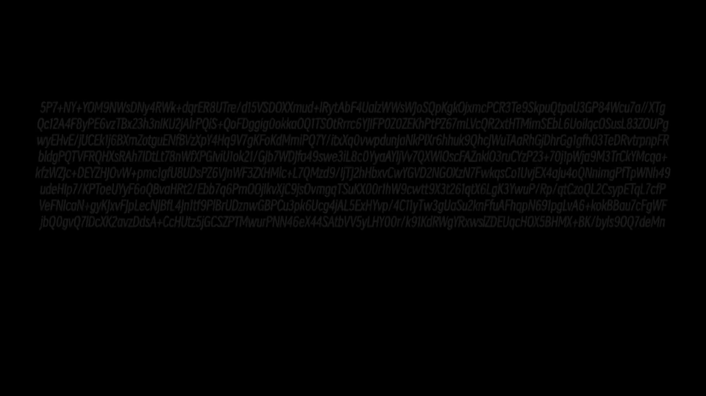

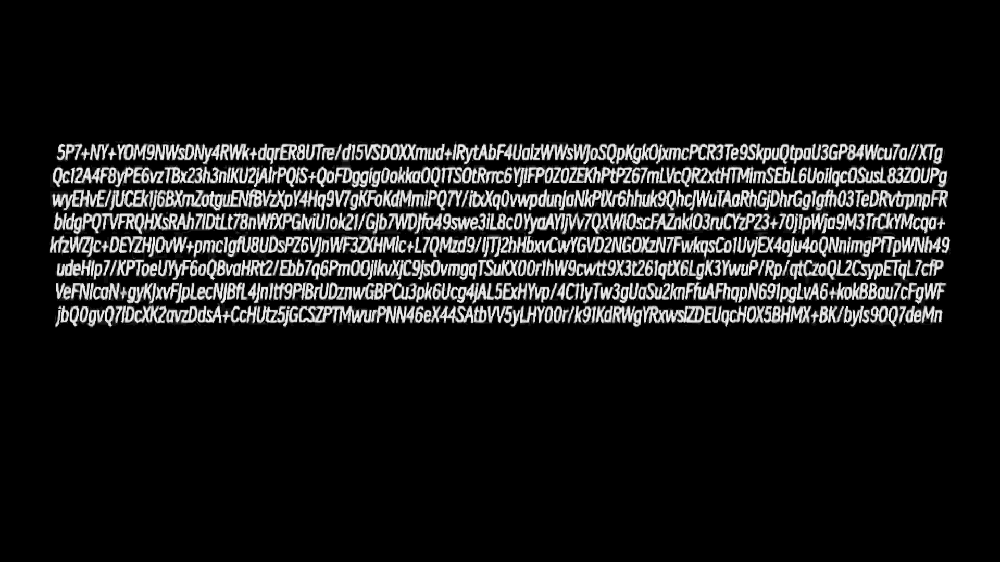

不太好辨认，以下结果未经核对。

```
5P7+NY+YOM9NWsDNy4RWk+dqrER8UTre/d15VSDOXXmud+lRytAbF4UalzWWsWjaSQpKgkOjxmcPCR3Te9SkpuQtpaU3GP84Wcu7a//XTg
Qc12A4F8yPE6vzTBx23h3nlKU2jAirPQIS+QoFDggig0okkaOQTTSOtRrrc6YJIFPOZOZEKhPtPZ67mlVcQR2xtHTMlmSEbL6UoilqcOSusL83ZOUPg
wyEHvE/jUCEk1j6BXmZotguENfBVzXpY4Hq9V7gKFoKdMmiPQ7Y/ItxXq0vwpdunJaNkPlXr6hhuk9QhcJWuTAaRhGJDhrGgIgfh03TeDRvtrpnpFR
bldgPQTVFRQHXsRAh7IDtLt78nWfXPGlviUlok21/Gjb7WDJfa49swe3ILBc0YyaAY1jVv7QXWIOscFAZnkIO3ruCYzP23+70JlpWja9M3TrCkYMcqa+
kfzWZJc+DEYZHlOvW+pmcIgfU8UDsPZ6VjnWF3ZXHMlc+L7QMzd9/ijTJ2hHbxvCwYGVD2NGOXzN7FwkqsCoIUvjEX4aju4oQNnimqPfTpWNlh49
udeHlp7/KPTaeUJyYF6oQBvaHRt2/Ebb7q6PmQOJlkvXjC9jsOvmgqTSuKXOOr1hW9rwtt9X3t261qtX6LgK3YwnlP/Rp/qtCzoQL2CsypETqL7cfP
VeFNicaN+gyKJxvFJpLecNJBfL4jnItf9PIBrUDznwGBPCu3pk6Ucg4jAL5ExHYvp/4C11yTw3gUaSu2knPfuAFhqpN691pgLvA6+kokBBau7cFgWF
jbQOgvQ7IDcXK2avzDdsA+CcHUtz5jGCSZPTMwurPNN46eX44SAtbVV5yLHY00r/k9IKdRWgYRxwsIZDEUqcHOX5BHMX+BK/byls90Q7deMn
```

#### 940 帧


`Pvydd ksm fnpm qk kalfs tzx dc oedx?`

#### 986 帧

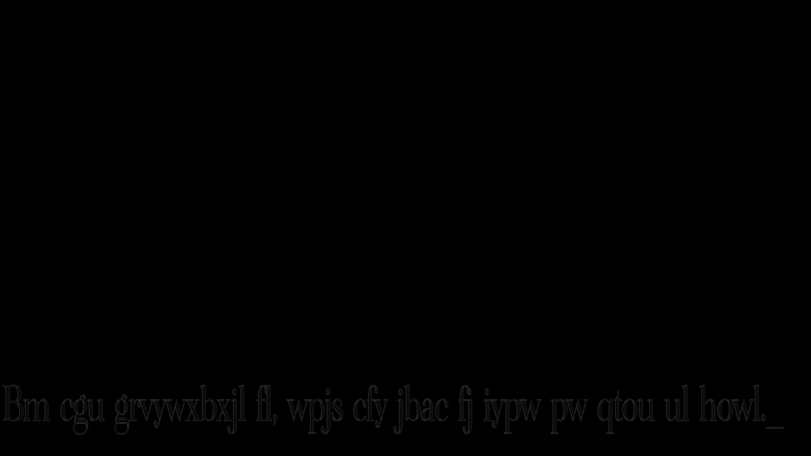

`Bm cgu grvywxbxjl fl, wpjs cfy jbac fj iypw pw qtou ul howl.`

#### 989-992 帧

闪过两段加密文本，推测为同一段。


#### 993 帧


主要是右侧两个图片的提示，尚不明确用途。

#### 1068 帧


古文字码，可能是编码错误所致，可以尝试还原。

#### 1069 帧


同上。

#### 1073&1078 帧


不清楚是否有加密信息，但看起来可疑。

#### 1092 帧


古文字码。

#### 1143 帧


同上。

#### 1151 帧


图片中间可能藏有文字，但难以识读。

#### 1154-2133 帧

画面中有不同位置的加密文本，由于视频后期处理效果有些画面难以辨识，尽量挑选出最清晰的一帧。

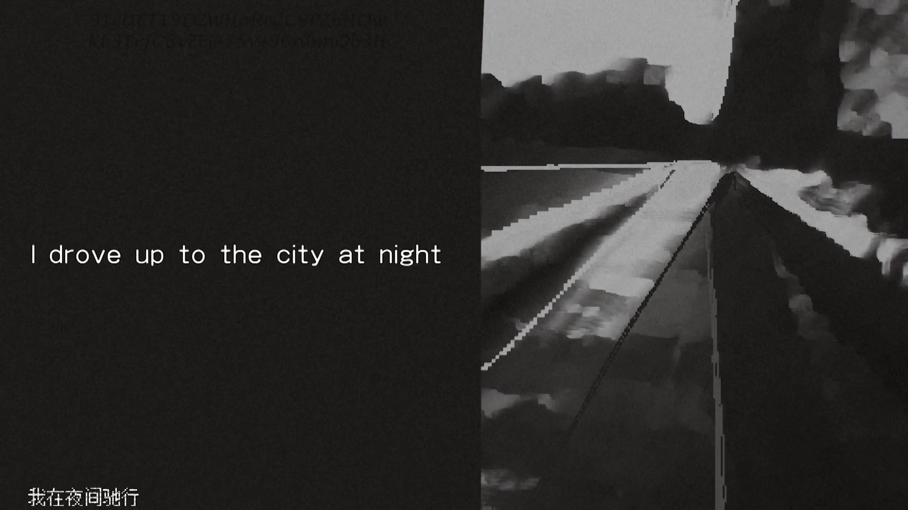

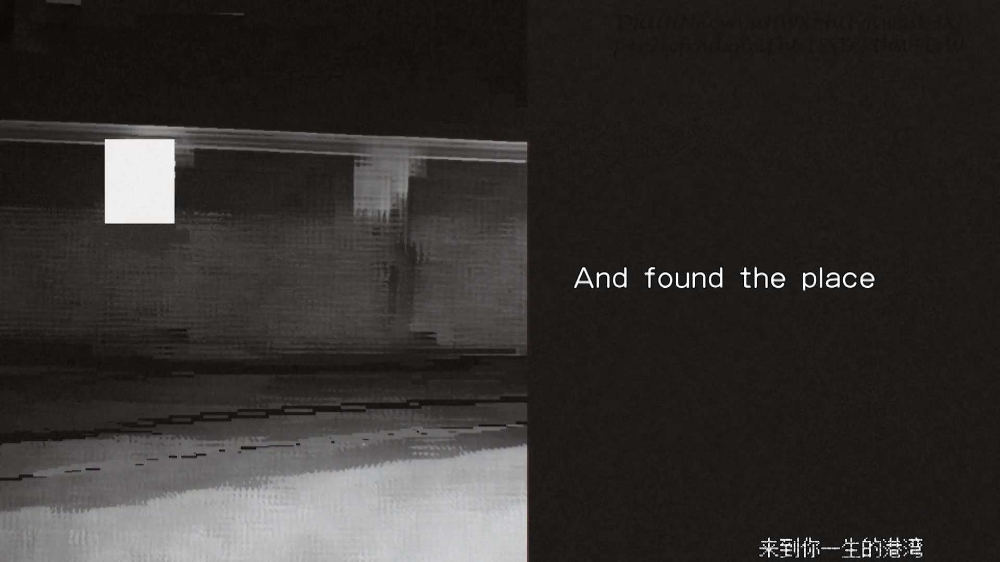


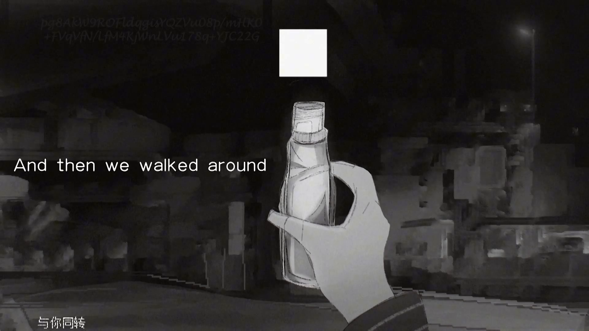

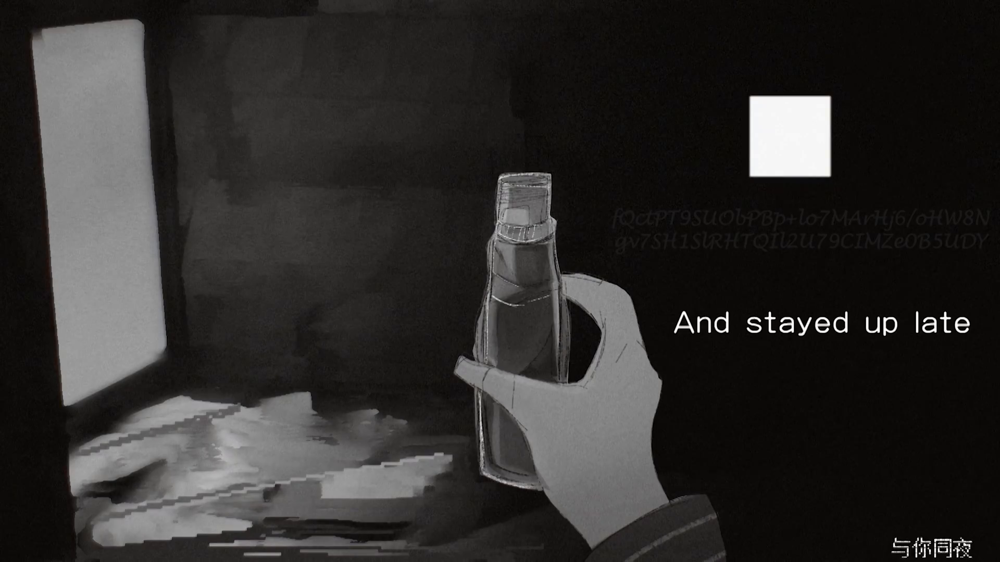

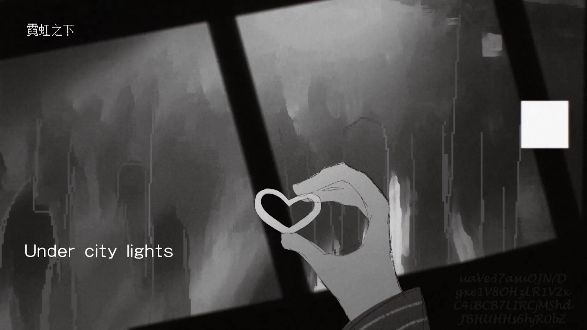

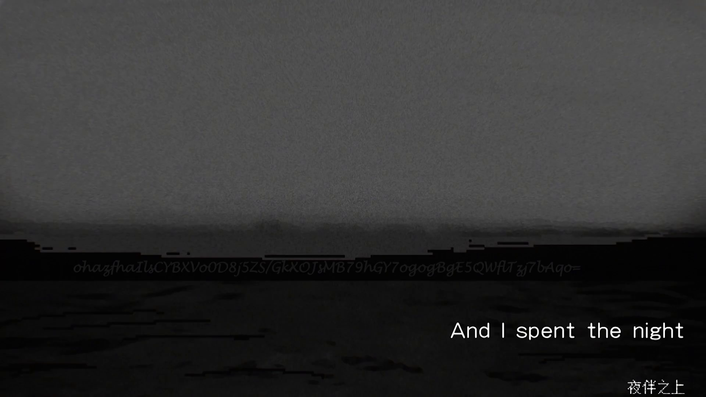

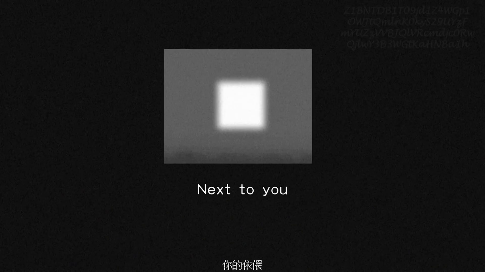


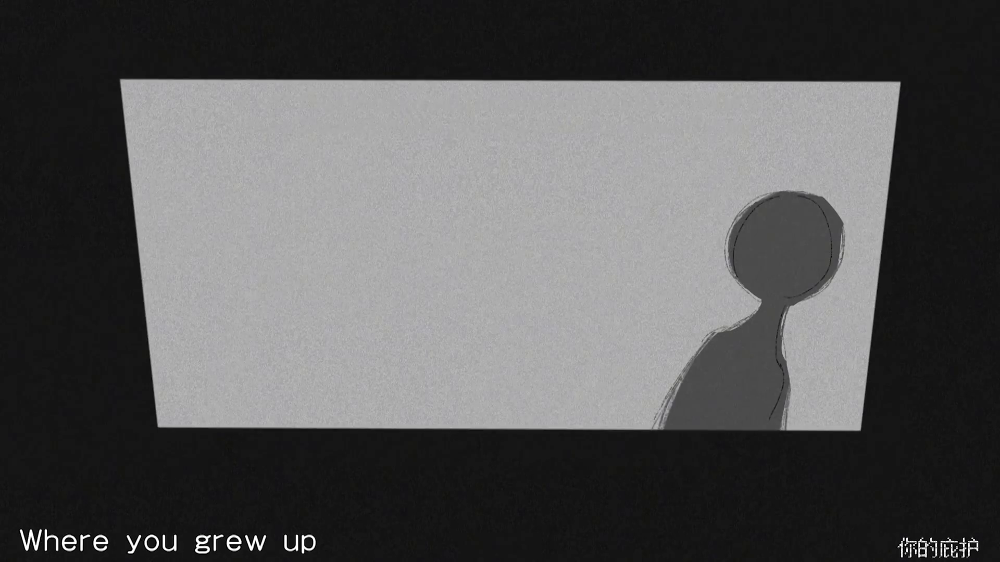

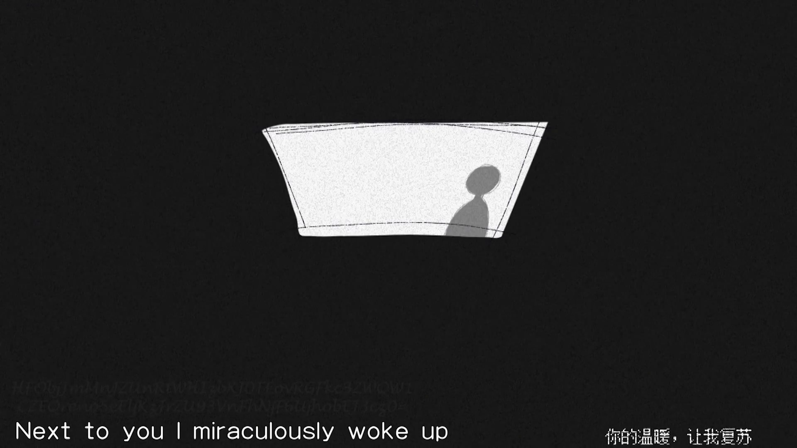

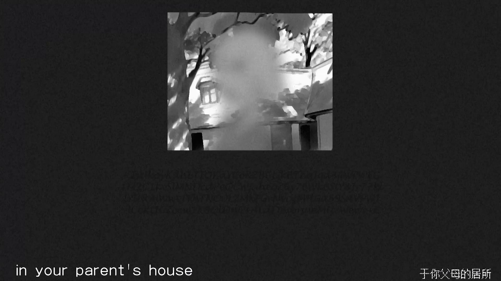

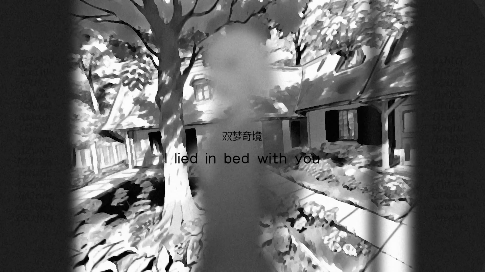

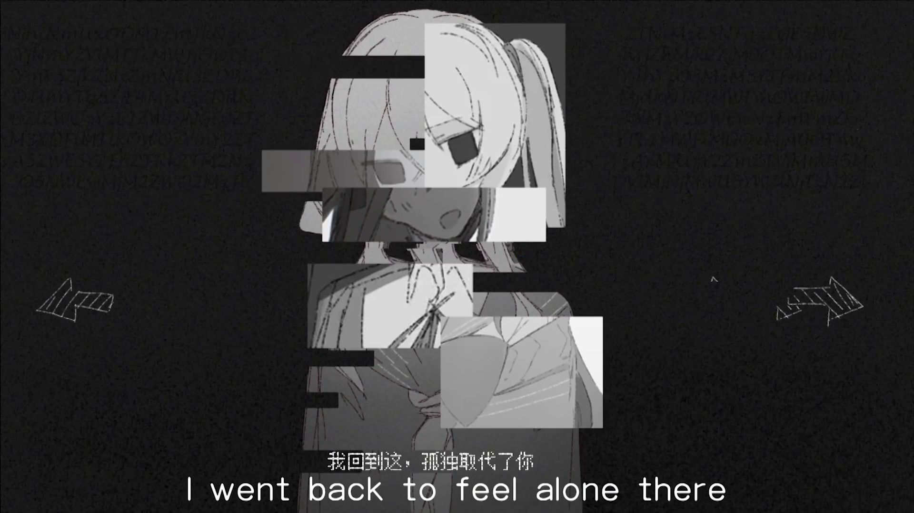


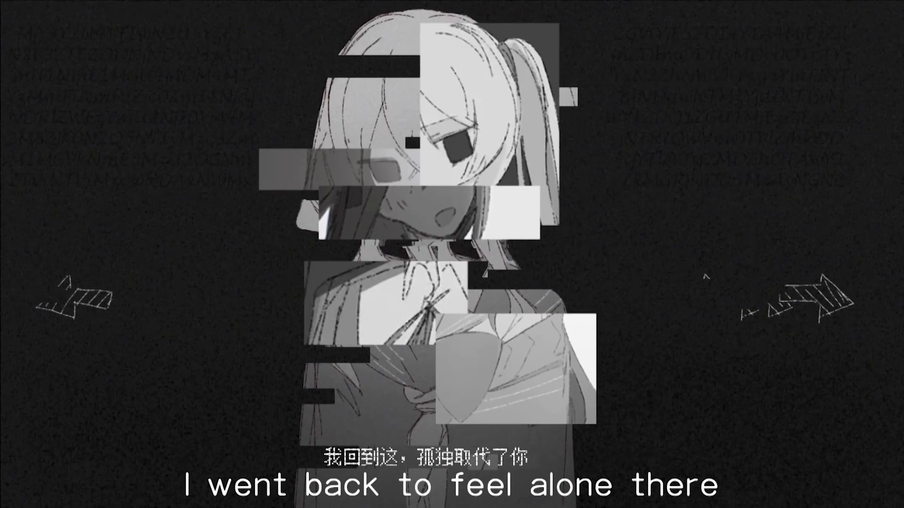

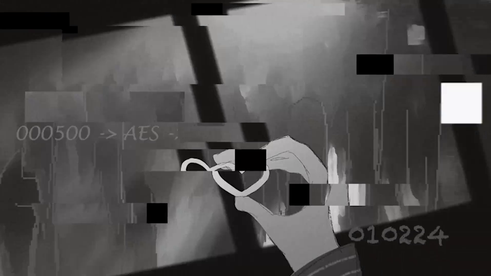

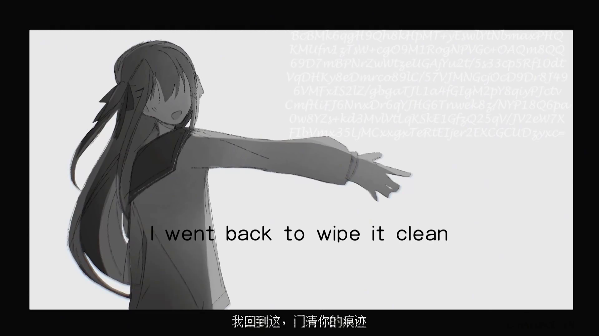

中间插入的画面可能是暗示这一段密文的解密方式。

#### 2242 帧


Unicode 编码，转写结果为 `有一个地方，跟地面上的世界不一样。那里充满奇幻、神秘和危险。`

2134-2370 帧画面应该出自 Meaning of Life，蜡烛出自 Candles，暂未发现其他线索。

白色方块不知道是否是线索。

#### 2497 帧


`I%20have%20a%20song%20that%20I%20never%20tire%20of%20listening%20to`

`%20` 为 url 编码的空格，尚不清楚是否有额外含义。

#### 2566 帧


可能是指 ARG 视频 hello, world。

### 14:30-

#### 1096 帧


```
V2FpdCwgd2FpdCwg
dW50aWwgdGhpbmdz
IGNoYW5nZSB3aXRo
IHRpbWUu
```

base64 解码结果为 `Wait, wait, until things change with time.`

#### 1598 帧


`RXZlcnkgd29yZCBoZXJlIGlzIHNvIGltcG9ydGFudC4=`

由于图片严重失真，识别结果不准确，通过部分识读和猜测得到原句

`Every word here is so important.`

## 单品投稿

所有帧均相同，取第一帧。


识别结果 `+>>>++++++++++[->+++++++++++>++++++++++>++++++++++++>++++++++++++>+++>>++++++++++++>++++++++++>+++++++++++>++++++++++>+<<<<<<<<<<<]>>+>>---->++>>---->+++++>->+[[<]<[<]<<<[->+>+<<]+>[-<+>]>[->>[.>]<[<]<]>>[>]>[.>]<]`

执行结果

